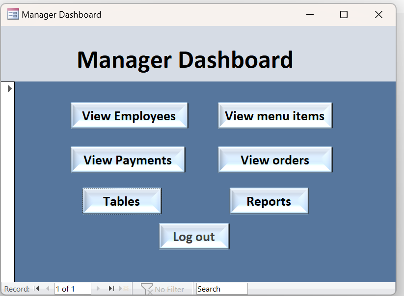
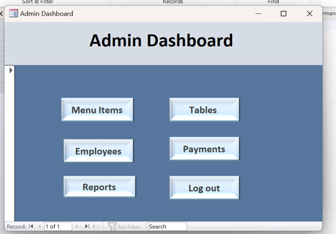
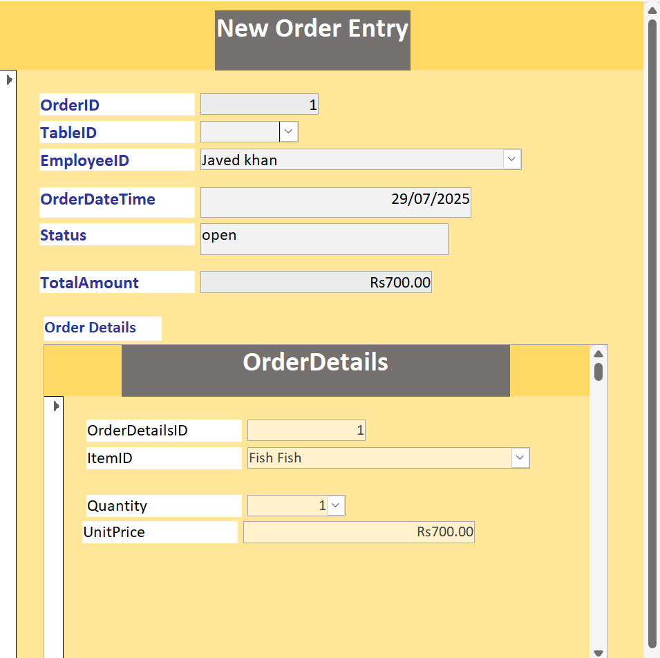
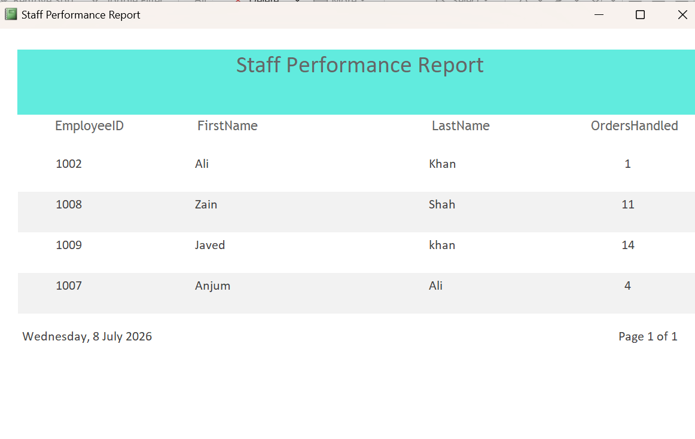
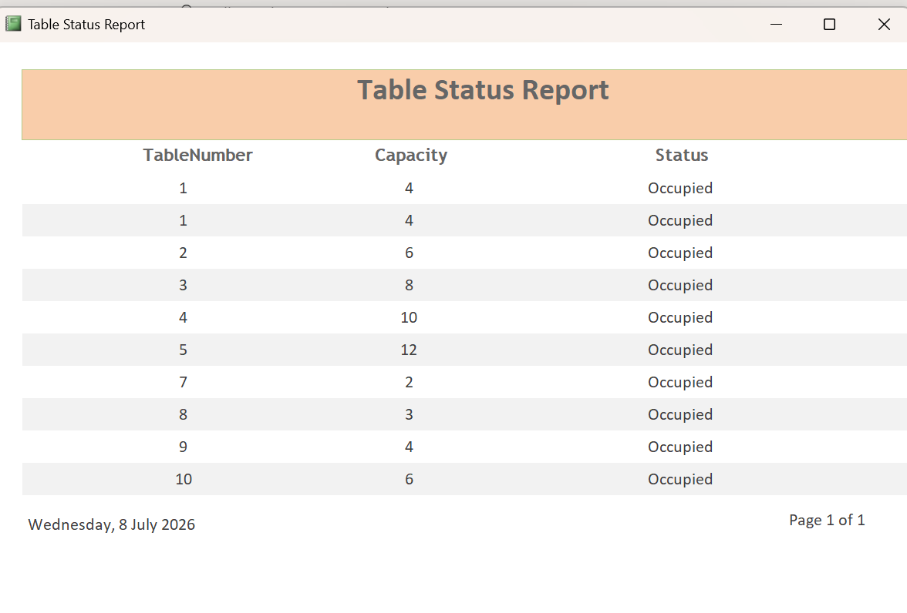

# 🍽️ Restaurant Management System

## Overview

The Restaurant Management System is a database application developed using **Microsoft Access** to streamline restaurant operations. It enables efficient management of customer orders, restaurant tables, employees, payments, and business reports through a role-based access system.

The application provides separate dashboards and permissions for **Waiters**, **Managers**, and **Administrators**, ensuring secure and organized restaurant management.

---

## Features

### Authentication
- Secure login system
- Role-based access control
- Separate dashboards for Waiter, Manager, and Admin

### Waiter Module
- Table assignment
- Customer order management
- Menu item selection
- Automatic bill calculation
- Payment processing
- Table status updates

### Manager Module
- Employee management
- Salary management
- Payment monitoring
- Sales reports
- Staff performance reports
- Restaurant activity monitoring

### Administrator Module
- User account management
- Role assignment
- Database maintenance
- Security management

---

## Database Design

The system consists of six relational database tables:

- Employees
- Tables
- MenuItems
- Orders
- OrderDetails
- Payments

The database uses **Primary Keys** and **Foreign Keys** to maintain referential integrity and relationships between entities.

---

## Reports

The system generates several reports including:

- Menu by Category
- Monthly Salary Report
- Non-Sellable Items Report
- Popular Items Sold
- Employee List Report
- Staff Performance Report
- Table Status Report

---

## Technologies Used

- Microsoft Access
- SQL
- Relational Database Design
- Forms
- Queries
- Reports

---

## Database Concepts Implemented

- Entity Relationship Design
- Primary Keys
- Foreign Keys
- One-to-Many Relationships
- SQL Queries
- Forms
- Reports
- Role-Based Access Control
- Data Validation

---

## Screenshots

### Login Screen

### Manager Dashboard

### Admin Dashboard

### Order Entry

### Reports

### Staff Performance Report

### Table Status Report

---

## Learning Outcomes

This project strengthened my understanding of:

- Database Systems
- Database Normalization
- SQL Query Design
- Relational Databases
- Microsoft Access Development
- Report Generation
- Database Security
- Business Process Automation

